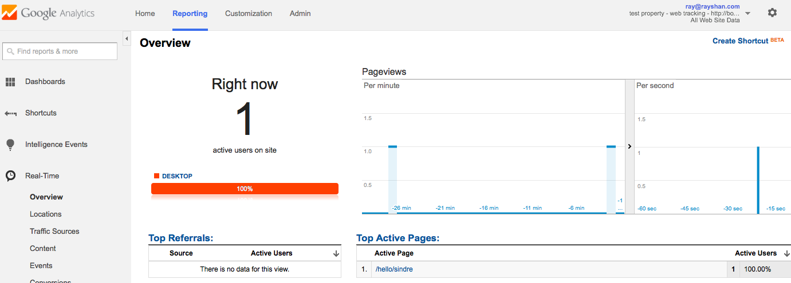

## Testing

In addition to the regular tests via `npm test`, contributors should also ensure the analytics tracking vendor continues to receive data.

### Google Analytics (GA)

Please sign up for a free GA web-tracking account, then run below script using your tracking code:

```js
var Insight = require('lib/insight.js');

var insight = new Insight({
  trackingCode: 'UA-00000000-0', // replace with your test GA tracking code
  packageName: 'test app',
  packageVersion: '0.0.1'
});

insight.track('hello', 'sindre');
```

Then visit GA's Real Time dashboard and ensure data is showing up:




## Other Guidelines

Please see Yeoman's [contributing docs](https://github.com/yeoman/yeoman/blob/master/contributing.md).
