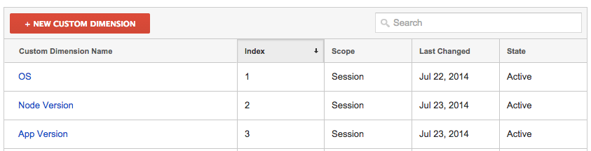
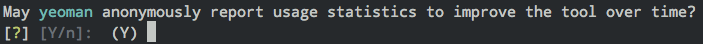

# Insight [](http://travis-ci.org/yeoman/insight)

Understand how your tool is being used by anonymously reporting usage metrics to [Google Analytics](http://www.google.com/analytics/)
or [Yandex.Metrica](http://metrica.yandex.com/)

*This module uses the [newly released Universal Analytics API](http://analytics.blogspot.com/2013/03/expanding-universal-analytics-into.html) from Google Analytics*


## Analytics dashboard example

Displaying metrics from [Yeoman](http://yeoman.io) which makes use of Insight.


## Provider Setup

### Google Analytics (GA)

Currently Insight should to be used with GA set up as web tracking due to use of URLs. Future plan include refactoring to work with GA set up for app-based tracking and the [Measurement Protocol](https://developers.google.com/analytics/devguides/collection/protocol/v1/).

For debugging, Insight can track OS version, node version and version of the app that implements Insight. Please set up custom dimensions per below screenshot. This is a temporary solution until Insight is refactored into app-based tracking.




## Example usage

*Google Analytics*

```js
var Insight = require('insight');
var pkg = require('./package.json');

var insight = new Insight({
	// Google Analytics tracking code
	trackingCode: 'UA-XXXXXXXX-X',
	packageName: pkg.name,
	packageVersion: pkg.version
});

// ask for permission the first time
if (insight.optOut === undefined) {
	return insight.askPermission();
}

insight.track('foo', 'bar');
// recorded in Analytics as `/foo/bar`
```

*Yandex.Metrica*

```js
var Insight = require('insight');
var pkg = require('./package.json');

var insight = new Insight({
	// Yandex.Metrica counter id
	trackingCode: 'XXXXXXXXX'
	trackingProvider: 'yandex',
	packageName: pkg.name,
	packageVersion: pkg.version
});

// ask for permission the first time
if (insight.optOut === undefined) {
	return insight.askPermission();
}

insight.track('foo', 'bar');
// recorded in Yandex.Metrica as `http://<package-name>.insight/foo/bar`
```

or a [live example](https://github.com/yeoman/yeoman)


## API

### Insight(settings)

#### trackingCode

Type: `string`  
**Required**

Your Google Analytics [trackingCode](https://support.google.com/analytics/bin/answer.py?hl=en&answer=1008080) or
Yandex.Metrica [counter id](http://help.yandex.com/metrika/?id=1121963).


#### trackingProvider

Type: `string`  
Default: `'google'`

Tracking provider to use  
Possible values are `'google'` or `'yandex'`


#### packageName

Type: `string`  
**Required**

Requires you to also specify `packageVersion`


#### packageVersion

Type: `string`  
Default: `'0.0.0'`

Requires you to also specify `packageName`

#### config

Type: `object`  
Default: An instance of [`configstore`](https://github.com/yeoman/configstore)

If you want to use your own configuration mechanism instead of the default
`configstore`-based one, you can provide an object that has to implement two
synchronous methods:

- `get(key)`
- `set(key, value)`


### Instance methods


#### .track(keyword, [keyword, ...])

Accepts keywords which ends up as a path in Analytics.

`.track('init', 'backbone')` becomes `/init/backbone`


#### .askPermission([message, callback])

Asks the user for permission to track and sets the `optOut` property. You can also choose to set this manually.



Optionally supply your own `message` and `callback`. If `message` is `null`, default message will be used. The callback will be called with the arguments `error` and `optOut` when the prompt is done, and is useful for when you want to continue the execution while the prompt is running.


#### .optOut

Returns a boolean whether the user has opted out of tracking. Should preferably only be set by a user action, eg. a prompt.


## License

[BSD license](http://opensource.org/licenses/bsd-license.php) and copyright Google
